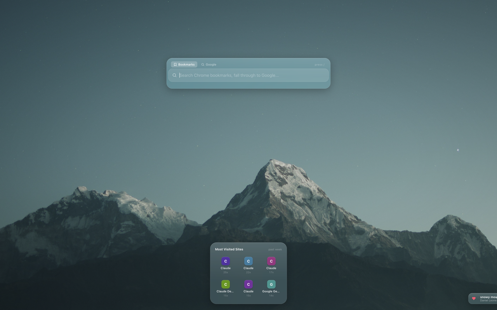
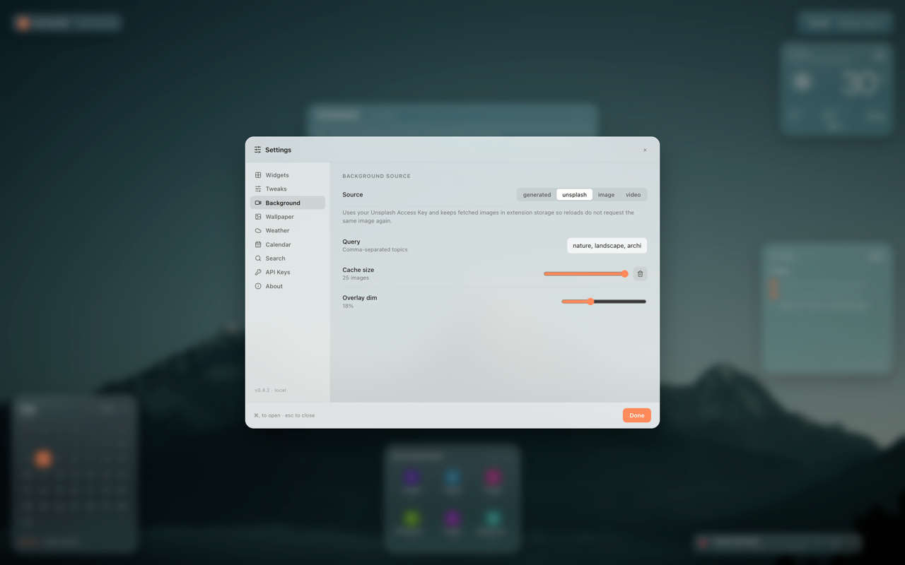
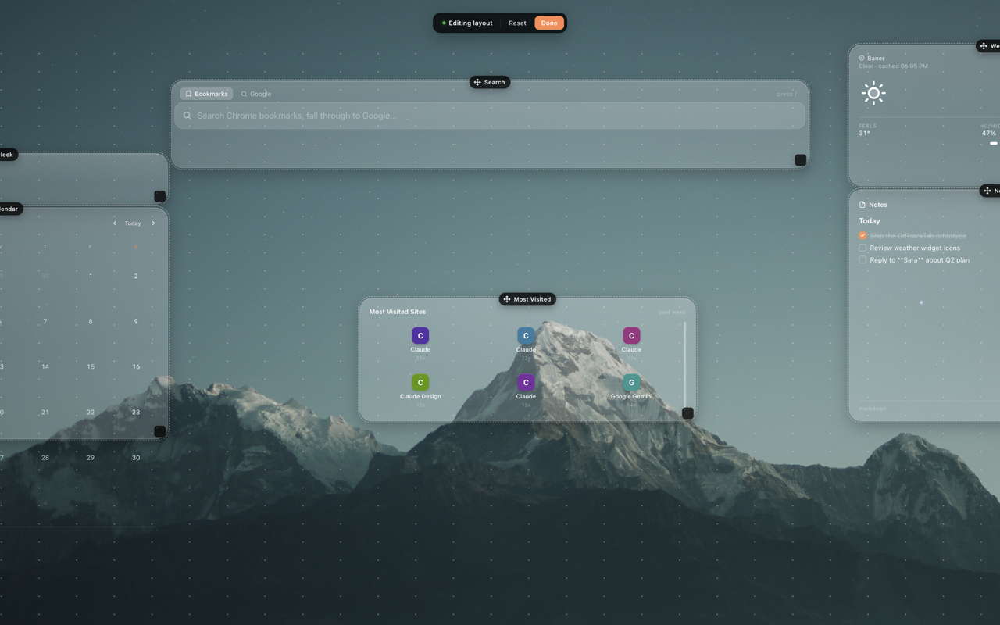
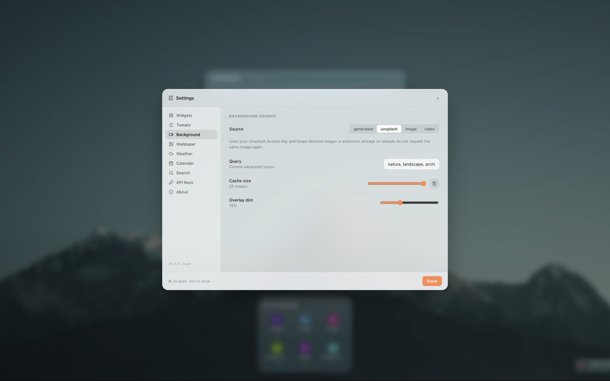
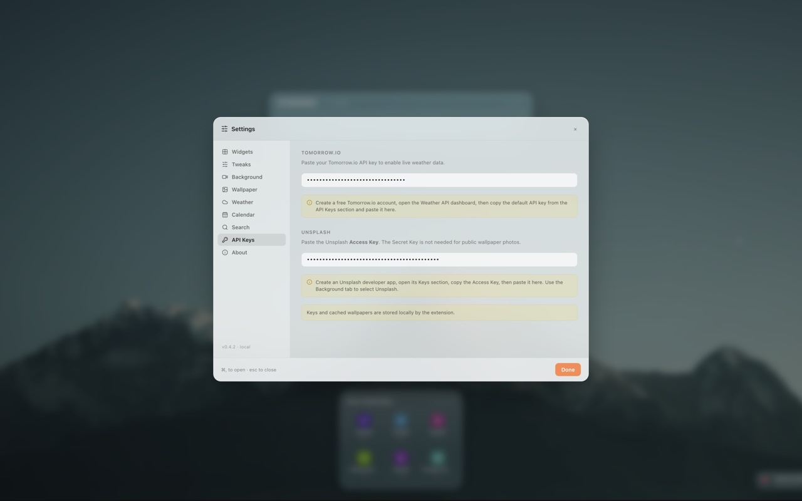

# OnTrackTab

OnTrackTab is a calmer, local-first Chrome new tab extension built with React, TypeScript, and Vite. It replaces the default new tab page with a customizable dashboard for search, time, weather, calendar, notes, most-visited sites, and rotating wallpapers.

## Features

- Chrome new tab override using Manifest V3.
- Bookmark-first search with selected-engine fallback, `/` bookmark focus, and `.` direct engine focus.
- Clock, weather, calendar, notes, and most-visited widgets.
- Grid layout mode with draggable and resizable widgets.
- Floating and bento layout modes with magnification and widget size controls.
- Generated canvas wallpapers, custom image/video backgrounds, and optional Unsplash wallpapers.
- Local settings storage for layout, notes, liked wallpapers, API keys, and widget preferences.
- Optional Tomorrow.io weather integration.
- Optional Unsplash wallpaper integration with local cache support.

## Screenshots











## Tech Stack

- React 18
- TypeScript
- Vite
- Chrome Extension Manifest V3
- react-grid-layout
- lucide-react

## Getting Started

Install dependencies:

```bash
npm install
```

Run the local dev server:

```bash
npm run dev
```

Build the extension:

```bash
npm run build
```

The production extension output is generated in `dist/`.

## Load In Chrome

1. Run `npm run build`.
2. Open Chrome and go to `chrome://extensions`.
3. Enable Developer mode.
4. Click Load unpacked.
5. Select the generated `dist/` folder.
6. Open a new tab.

## API Keys

API keys are optional. Without them, OnTrackTab still works with generated wallpapers, local notes, calendar, search, and fallback/demo weather data.

### Tomorrow.io

Used for live weather data.

1. Create a free Tomorrow.io account.
2. Open the Weather API dashboard.
3. Copy the default API key from the API Keys section.
4. Open OnTrackTab settings, go to API Keys, and paste it under Tomorrow.io.

### Unsplash

Used for live wallpaper photos.

1. Create an Unsplash developer app.
2. Open the app's Keys section.
3. Copy the Access Key. The Secret Key is not needed.
4. Open OnTrackTab settings, go to API Keys, and paste it under Unsplash.
5. In the Background tab, choose Unsplash as the source.

## Privacy And Storage

OnTrackTab is local-first. Settings, notes, liked wallpapers, cached Unsplash wallpapers, and API keys are stored locally using browser storage or local storage. The extension only calls external APIs when the user adds the relevant API key and enables that feature.

Chrome permissions are used for:

- `storage`: save settings and cached extension data.
- `bookmarks`: power bookmark search.
- `history` and `topSites`: show most-visited sites.

Host permissions are limited to Tomorrow.io and Unsplash endpoints used by the weather and wallpaper integrations.

## Project Structure

```text
src/
  components/      UI components and widgets
  constants/       Default tweak/settings values
  hooks/           Reusable React state hooks
  lib/             Storage, migration, and rendering helpers
  services/        External API integrations
  styles/          Application CSS
  types/           Shared TypeScript types
```

## Scripts

- `npm run dev`: start Vite locally.
- `npm run build`: type-check and build the extension into `dist/`.
- `npm run preview`: preview the built Vite app locally.
